# Live Conversation Architecture

The `/tutor` route uses Gemini Live for bidirectional audio and transcription. This document describes the implementation on the live voice/transcript stabilization branch.

## Ownership

Application-visible state lives in the Zustand audio store:

- live connection state
- safe user-facing error text
- selected microphone ID
- mute state
- input/output levels
- current tutor agent state
- language, proficiency, voice, topic, and practice settings
- transcript state

Runtime resources do **not** live in Zustand. The store closure owns the active `LiveManager` and `LearningSessionRecorder` references. `LiveManager` exclusively owns:

- Gemini `Session`
- `MediaStream` and microphone tracks
- input/output `AudioContext`
- `MediaStreamAudioSourceNode`
- `AudioWorkletNode`
- output `GainNode` and `AnalyserNode`
- scheduled `AudioBufferSourceNode` instances
- playback timeline/queue
- connection generation

The Tutor route also mounts a small lifecycle component whose only responsibility is to call the store's idempotent disconnect action when the route unmounts. This prevents microphone/provider resources from surviving navigation.

## Data flow

```mermaid
flowchart LR
    UI[Tutor UI] --> Store[Zustand audio store]
    Store --> Live[LiveManager]
    Live --> Mic[getUserMedia]
    Mic --> InputCtx[Input AudioContext]
    InputCtx --> Worklet[Mic AudioWorklet ~40 ms chunks]
    Worklet --> PCM[Float32 to Int16 PCM]
    PCM --> Gemini[Gemini Live session]

    Gemini --> Normalize[normalizeGeminiMessage]
    Normalize --> Transcript[Pure transcript reducer]
    Transcript --> Store
    Transcript --> Recorder[LearningSessionRecorder]

    Normalize --> Queue[Serialized playback queue]
    Queue --> OutputCtx[24 kHz output AudioContext]
    OutputCtx --> Speaker[Browser output]
    Store --> UI
```



## Session lifecycle

The UI uses explicit states:

```text
DISCONNECTED
  -> CONNECTING        token request
  -> REQUESTING_PERMISSION
  -> CONNECTING        audio graph + Gemini connection
  -> CONNECTED
  -> DISCONNECTING
  -> DISCONNECTED
```

Expected failures may enter `ERROR`. A retry starts a new explicit connection attempt.

The store maintains a connection-attempt number for token-request cancellation. `LiveManager` independently maintains a monotonically increasing generation. Async media/provider work and provider callbacks may publish state only while their captured generation remains current.

Manual disconnect invalidates the generation before cleanup. Provider close/error handlers also re-check their cleanup generation after asynchronous cleanup completes, so a stale close cannot overwrite a newer disconnect/reconnect state.

There is no automatic reconnect loop.

## Microphone pipeline

```text
selected microphone
  -> getUserMedia (mono, echo cancellation, noise suppression, AGC)
  -> input AudioContext
  -> MediaStreamAudioSourceNode
  -> mic-processor AudioWorklet
  -> ~40 ms Float32 chunks
  -> Int16 little-endian PCM
  -> Gemini sendRealtimeInput
```

The requested input context rate is 16 kHz, but browsers/devices may use a different actual rate. PCM metadata uses `inputAudioContext.sampleRate` rather than blindly declaring 16 kHz.

Mute disables the microphone track and prevents worklet chunks from being sent. The selected device ID is passed to `getUserMedia` on the next connection. Device selection is disabled while a connection attempt/session is active because changing the selector does not replace the existing `MediaStream`.

The worklet batches render quanta into approximately 40 ms chunks instead of posting every 128-frame quantum. Output level analysis still samples on `requestAnimationFrame`, but publishes UI state at roughly 20 Hz rather than every frame.

## Gemini boundary

Provider-specific server message interpretation is centralized in:

```text
lib/live/gemini-events.ts
```

It converts `LiveServerMessage` into only the signals the application needs:

- user voice-activity start/end
- interim input transcription
- input transcription chunks plus SDK `finished` state
- output transcription chunks plus SDK `finished` state
- interruption
- turn completion
- audio chunks
- waiting/in-progress flags

The installed `@google/genai@2.19.0` SDK type exposes an optional `Transcription.finished?: boolean`, and the application honors it when present. The Live API wire contract does not require that field and input/output transcriptions can arrive independently, so correctness does not depend on `finished` being emitted.

All audio parts in a model turn are inspected. The implementation does not assume audio is always `parts[0]`.

The configured model is:

```text
gemini-2.5-flash-native-audio-preview-12-2025
```

The previous `09-2025` preview identifier is not used by this branch.

Native-audio models choose spoken language automatically. The selected language remains part of the tutor system instruction.

## Transcript model

`lib/live/transcript.ts` is a pure reducer with no React, Zustand, Gemini connection, microphone, or Web Audio dependency.

A transcript message has:

- stable local ID
- `user` or `assistant` speaker
- text
- `streaming` or `complete` status
- start/completion timestamps

The state keeps explicit input/output streaming buffers and immutable completed rows.

### Input semantics

`interimInputTranscription` is a replaceable low-latency snapshot and updates the current user row in place.

`inputTranscription.text` is treated as transcription chunks and appended in provider order. Legitimate repeated speech such as `"very "` + `"very "` remains `"very very "`; arbitrary overlap heuristics are deliberately avoided.

When `inputTranscription.finished === true`, the user row can be finalized immediately. When that signal is absent, `turnComplete`, user voice activity, the next input boundary, and session end provide deterministic fallback boundaries. If input transcription arrives after assistant output has begun, the reducer preserves the earlier user activity position and withholds persistence until chronological predecessors are resolved.

### Output semantics

`outputTranscription.text` chunks append in provider order. `outputTranscription.finished === true` finalizes the assistant row when that optional signal is available; `turnComplete` remains the normal fallback.

Assistant output does **not** finalize a pending user row, because Gemini input and output transcription delivery can be independent. If assistant transcription arrives before any user transcript/activity evidence, the reducer creates an implicit ordering reservation: the assistant row may render and play normally, but it is not released to persistence until a late user transcript, a later input boundary, or session end resolves whether earlier user text exists.

`turnComplete` remains a fallback boundary for provider cases where `finished` is absent or has not finalized streaming text. It will not finalize user input while user voice activity is currently active. If a delayed input transcription arrives after `turnComplete`, the reducer keeps that prior-turn reservation open and seals it at the next deterministic input/session boundary so it cannot leak into the next utterance.

### Interruption

When an interrupted update arrives:

1. any transcript fragment carried by that server update is applied;
2. the assistant streaming transcript is finalized once;
3. playback is reset immediately;
4. audio bytes carried by that interrupted server update are discarded;
5. future model audio is allowed on a fresh playback epoch.

This preserves observed text without replaying obsolete speech.

### Session end

On manual disconnect, unexpected provider close/error, or Tutor route unmount, the store first emits a `session-end` transcript event before finalizing persistence.

The explicit policy is:

- discard speculative interim-only user text that was never confirmed by input transcription;
- preserve committed user transcription;
- preserve observed assistant output transcription;
- clear streaming buffers before the next session.

A new connection creates a new transcript-session identity, so streaming state cannot leak across reconnects.

Only reducer-returned **newly completed** rows are persisted to `LearningSessionRecorder`.

## Playback

Gemini native audio output is decoded as mono 16-bit PCM at 24 kHz.

Audio chunks pass through one promise chain before scheduling. This prevents asynchronous decode completion from reordering chunks.

Each queued chunk captures a playback epoch. Interruption or disconnect increments the epoch, stops active sources, clears the source collection, resets `nextStartTime`, and starts a fresh queue. A decode that completes after its epoch became stale is ignored.

`ended` handlers remove sources from the collection and disconnect their nodes.

## Cleanup

`disconnect()` is intentionally safe to call repeatedly.

Cleanup:

- invalidates the current connection generation
- optionally closes the Gemini session
- cancels output-level animation
- resets playback epoch and stops queued/active output
- clears the worklet message callback and closes its port
- disconnects source/worklet/output nodes
- stops all microphone tracks
- closes audio contexts
- resets runtime references and playback timeline
- resets mute/audio-level/agent state
- applies the transcript session-end policy before recorder finalization

Independent cleanup operations are best-effort so one already-closed resource does not prevent later resources from being released.

## Error handling

Live runtime errors use stable internal codes with safe messages:

- `microphone_permission_denied`
- `microphone_unavailable`
- `live_connection_failed`
- `audio_worklet_failed`
- `audio_decode_failed`
- `session_closed`
- `unknown`

Ephemeral tokens, API keys, raw audio, and full transcripts are not logged.

The existing authenticated `/api/token` endpoint remains the credential boundary; the Gemini API key stays server-side.

## Provider session limits

This branch intentionally does not add automatic Live-session resumption or context-window compression. If Gemini closes a long-running session or sends a provider shutdown/go-away signal, the current behavior is to clean up safely, surface the ended session, finalize observed transcript data, and let the learner reconnect. Session resumption/context compression can be added separately if uninterrupted very-long sessions become a product requirement.

## Rendering and scrolling

The transcript UI subscribes only to transcript messages. Controls, status, practice setup, and visualization use focused Zustand selectors, so high-frequency audio-level updates do not force unrelated Tutor components to rerender.

`use-stick-to-bottom` follows new content while the user is at the bottom and exposes a "scroll to latest" control after the user scrolls upward.

Desktop uses the right transcript sidebar. Mobile uses the existing transcript sheet opened from the navbar; the refactor does not create a second overlapping transcript surface.

## Tests

Deterministic tests cover:

- interim input snapshot replacement
- input/output transcription delta accumulation
- optional SDK `finished` finalization plus no-`finished` fallbacks
- late input arriving after assistant output or after `turnComplete`
- repeated-word preservation
- speaker ordering
- barge-in and interruption boundaries
- `turnComplete` fallback behavior
- whitespace handling
- disconnect/session-end policy
- reconnect isolation
- stable message IDs
- Gemini message normalization
- all model-turn audio parts
- PCM bounds, clamping, byte length, and actual sample-rate metadata

Browser-owned resources are verified at the integration/E2E layer rather than by building one large test that mocks `window`, `navigator`, AudioContext, Gemini, Zustand, and React simultaneously.
